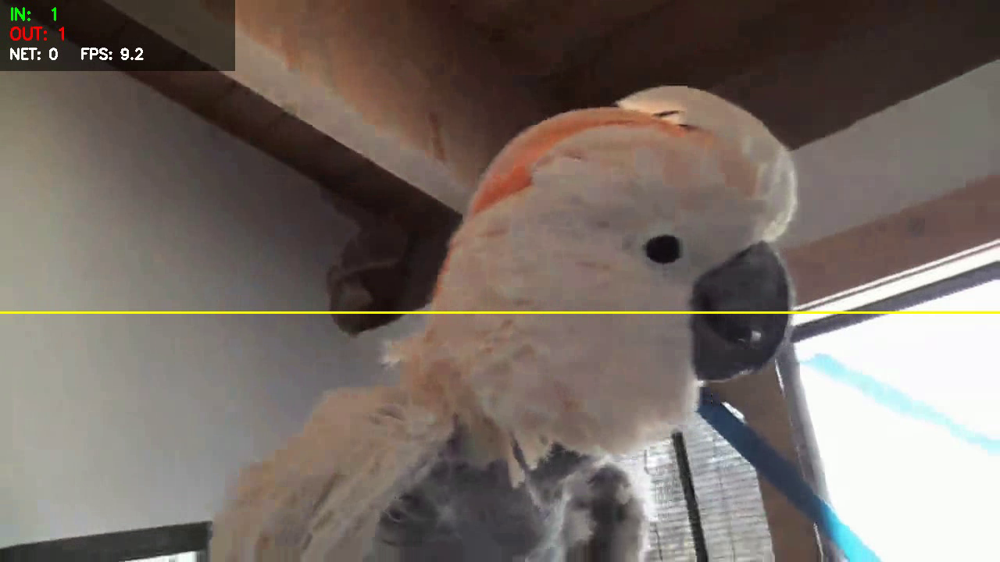

# Real-Time Multi-Object Tracking & Line-Crossing Counter

A real-time computer vision pipeline that combines **YOLOv8** (detection) with
**ByteTrack** (multi-object tracking) to assign persistent IDs to objects
across video frames, and adds a **virtual trip-wire line** that counts
objects as they cross it, in either direction.

This is the kind of pipeline used in retail footfall analytics, traffic
monitoring, and surveillance systems: detect → track → count/analyze.


*Sample output: detection box, motion trail, counting line, and live IN/OUT/NET dashboard.*

## Why this project

Most YOLO demos stop at "trained a model, got X mAP." This project goes one
step further by chaining detection into a tracker and building actual
application logic (identity persistence + counting) on top — closer to how
this would look in a real product (footfall counters, traffic dashboards,
queue monitoring, etc.).

## How it works

1. **Detection** — YOLOv8 (pretrained on COCO) finds objects in every frame.
2. **Tracking** — ByteTrack links detections across frames into consistent
   track IDs, using motion prediction and IoU-based matching, so the same
   object keeps the same ID even through brief occlusion.
3. **Counting** — a virtual line is defined by two points. Each tracked
   object's center point is checked frame-to-frame: if it was on one side of
   the line last frame and the other side this frame, that's a crossing.
   The sign of the change determines the direction (`in` vs `out`). This is
   implemented from scratch in [`src/line_counter.py`](src/line_counter.py)
   using a 2D cross-product side test — no extra library needed.
4. **Output** — an annotated video (boxes, IDs, motion trails, the counting
   line, and a live IN/OUT/NET dashboard) plus a CSV log of every crossing
   event (`outputs/crossing_log.csv`).

## Project structure

```
yolo-tracking-project/
├── README.md
├── requirements.txt
├── config.yaml                # model, class filter, line position, output settings
├── src/
│   ├── track_and_count.py     # main pipeline: detect + track + count + render
│   └── line_counter.py        # LineZone (crossing logic) + TrackHistory (trails)
├── sample/
│   ├── sample_video.mp4       # small bundled clip so the demo runs out of the box
│   └── demo_preview.png       # static preview frame for this README
└── outputs/                   # annotated_output.mp4 + crossing_log.csv land here
```

## Setup

```bash
git clone <this-repo-url>
cd yolo-tracking-project
pip install -r requirements.txt
```

YOLOv8 weights (`yolov8n.pt`) are downloaded automatically by the
`ultralytics` package the first time you run the script.

## Usage

Run from the project root (paths in `config.yaml` are relative to it):

```bash
# Quick demo on the bundled sample clip (no extra download needed)
python src/track_and_count.py

# Your own video file
python src/track_and_count.py --source path/to/your_video.mp4

# Live webcam (0 = default camera), with a preview window
python src/track_and_count.py --source 0 --show

# Cap how many frames to process (useful while testing)
python src/track_and_count.py --max-frames 200
```

Outputs land in `outputs/`:
- `annotated_output.mp4` — the video with boxes, IDs, trails, line, and dashboard
- `crossing_log.csv` — one row per crossing event: `frame, track_id, class, direction`

### Note on the bundled sample clip

`sample/sample_video.mp4` is a short public-domain clip containing a bird, so
the shipped `config.yaml` filters for COCO class `14` (bird) — this makes the
demo work immediately with zero setup. **For a real person/vehicle counting
use case**, point `--source` at your own footage and change `classes` in
`config.yaml` to something like `[0, 1, 2, 3, 5, 7]` (person, bicycle, car,
motorcycle, bus, truck), and move `counting_line` to match your camera's
framing (e.g. a doorway or road lane).

## Configuration (`config.yaml`)

| Field | Meaning |
|---|---|
| `model.weights` | YOLOv8 checkpoint to use (`yolov8n.pt`, `yolov8s.pt`, ...) |
| `model.tracker` | Tracker config bundled with `ultralytics` (`bytetrack.yaml`) |
| `model.confidence` | Minimum detection confidence |
| `model.classes` | COCO class IDs to detect/track |
| `counting_line.point_a/point_b` | Pixel coordinates of the two ends of the counting line |
| `output.save_video` / `output_path` | Whether/where to save the annotated video |
| `output.draw_trails` / `trail_length` | Toggle and length of motion trails |

## Design notes / things I'd highlight in an interview

- **Why ByteTrack over DeepSORT/StrongSORT**: ByteTrack associates *all*
  detection boxes (including low-confidence ones) instead of discarding them
  before matching, which recovers more true positives during partial
  occlusion — and it's lighter-weight since it doesn't need a learned
  re-identification embedding network. DeepSORT/StrongSORT trade extra
  compute for stronger identity preservation in dense/occluded scenes; that's
  the accuracy-vs-speed tradeoff to bring up.
- **Why a side-of-line test for counting, not just "did the box overlap the
  line"**: checking the sign of the 2D cross product per frame is O(1) per
  track, has no dependency on box size, and directly gives you crossing
  direction for free (the sign of the change), which a simple overlap check
  doesn't.
- **Known limitations**: line-crossing counts can double-count if a track ID
  is lost and re-assigned right at the line (a tracker robustness issue, not
  a counting-logic issue); very fast objects can skip past the line between
  frames without a detected crossing (mitigated by a higher-FPS video or a
  wider "line" band instead of a single line — worth mentioning as a next step).

## Possible extensions

- Fine-tune YOLO on a domain-specific dataset (e.g. only vehicles, PPE gear)
  instead of using pretrained COCO classes.
- Add multiple counting lines/zones (e.g. separate lanes) and per-zone dwell
  time (loitering detection).
- Benchmark ByteTrack vs. DeepSORT vs. StrongSORT on a MOT17/MOT20 sequence
  for a quantitative tracker comparison (MOTA/IDF1 metrics).
- Export the model to ONNX/TensorRT and benchmark FPS on an edge device
  (Jetson Nano, Raspberry Pi + Coral).

## Requirements

- Python 3.9+
- See `requirements.txt` (`ultralytics`, `opencv-python`, `pyyaml`, `lap`)
- GPU optional — runs in real time on CPU with `yolov8n` at reduced resolution;
  a GPU (or Colab/Kaggle free tier) helps if you fine-tune on custom data.

## License

MIT — see [LICENSE](LICENSE).
